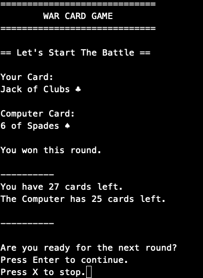

# war-card-game

A python script to allow a player to play a war card game against a computer.

  # Getting Started
    * Clone Repository
    * Go to Project Directory
    * Run:  python3 main.py
  
  # Example Game Round

  

  # Questions
    For any questions about the project, please visit my 
    GitHub Profile: [flirtara](https://github.com/flirtara) 
    or reach out to me @ kims.help.line@gmail.com
